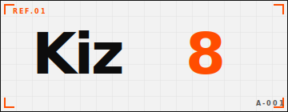

<picture>
  <source media="(prefers-color-scheme: dark)" srcset="./assets/logo-grid-stamp-inverse.svg">
  
</picture>

 
 

### We build and deploy **AI agents** inside your company.

`2026 · 40+ AGENTS SHIPPED · 12 LIVE NOW · AVG TIME-TO-PROD 6W`

 

---

## / what_we_do

**Kiz8 is an AI integration partner — not a platform, not a SaaS.**

We embed with your team, design the agent, ship the code into your stack, and keep it running. Repo lives in your org. Rollback is one click. On-call P1 is under 15 minutes.

 

---

## / services

| | | |
|---|---|---|
| **AI Agents** | autonomous · task-specific | Fraud triage · ops copilots · doc processing · sales qualification |
| **RAG Systems** | on your private data | Vector + BM25 hybrid · permission-aware · audit trail · domain reranker |
| **Data Pipelines & MLOps** | terabyte-scale | Kafka / CDC · dbt / Airflow · feature store · model registry |
| **Custom ML Models** | fraud · forecasting · recs | Bespoke models against your specific signal and your specific edge cases |
| **AI Discovery** | strategy · roadmap · ROI | Use-case scoring · data readiness · build vs. buy · 12-mo roadmap |

---

## / facts

|       |                            |       |                              |
| ----- | -------------------------- | ----- | ---------------------------- |
| `40+` | agents in production       | `22`  | engineers                    |
| `7`   | client industries          | `6 w` | avg. time to first agent     |
| `0`   | rollbacks on customer ask  | `4 y` | avg. client retention        |
| `98.3%` | projects shipped on time | `<15m` | on-call P1                  |

---

## / principles

**01 · Ship · then measure**
We don't build "PoCs". Every engagement ships to prod with SLOs, rollbacks and monitoring on day one.

**02 · Reversible by default**
Every agent we put in the loop has a kill-switch, a manual override, and an audit trail. Nothing goes one-way.

**03 · Own the boring layer**
Eval harnesses, data pipelines, observability. The unglamorous work that decides whether AI survives contact with reality.

**04 · No model-worship**
We use the smallest model that clears the bar. Frontier weights are an option, not a brand.

---

## / stack

`GPT-4/5` · `Claude` · `Llama` · `Mistral` · `fine-tuning` · `evals`
`AWS` · `GCP` · `Kubernetes` · `Terraform` · `Docker` · `edge`
`Snowflake` · `BigQuery` · `Kafka` · `dbt` · `Airflow` · `Iceberg`
`TypeScript` · `React` · `Next` · `Python` · `Go` · `Rust`

---

## / contact

> **Tell us what you want to automate.**
> Send us one paragraph about the workflow you'd hand to an agent. We'll reply with a 30-min discovery call and a shortlist of what's actually worth building.

▸ **Site** — [kiz8.com](https://kiz8.com)
▸ **Email** — [hello@kiz8.com](mailto:hello@kiz8.com)
▸ **Book a call** — [cal.com/kiz8](https://cal.com/kiz8)

 

`LISBON · REMOTE (GLOBAL) · EU / US / CIS · REPO-OWNED IN YOUR ORG`

